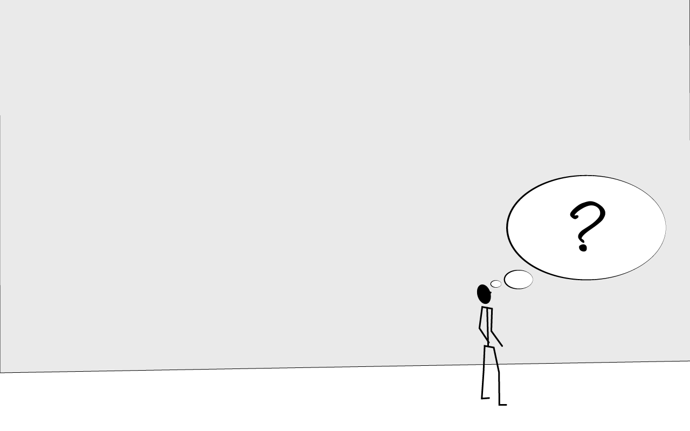
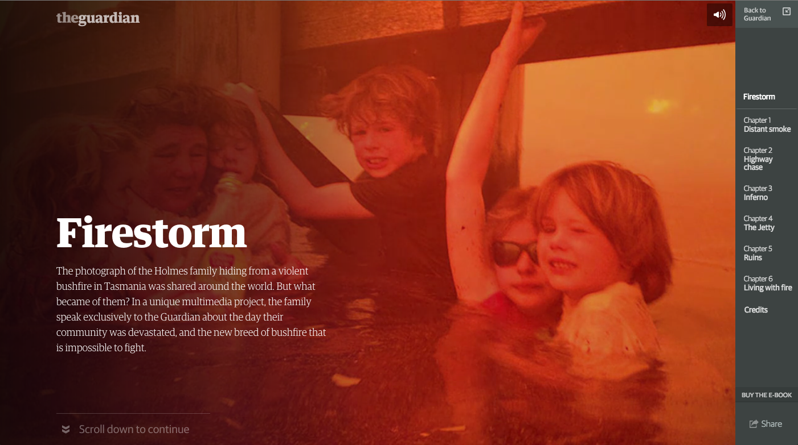

slidenumbers: true

# Storytelling
---

## Überblick
- Warum
- Grundlagen Storytelling
- Beispiele

---

# Warum?

---

# User Engagement / User Experience
- **Interaktion** mit der Seite
- **Mehrwert** für den Nutzer

=> Mehr Zeit und Aufmerksamkeit des Nutzers erhalten
=> Motivation zur Wiederkehr

---

### User Engagement / User Experience

---

### 41 Mio. täglich Online (2014)

---

### 166 Minuten / Tag

---

### Meist besuchteste Seiten

---
### Content is King!

---

## Content
- *Welche Inhalte* werden auf der Seite vermittelt
- Werden die Inhalte *übersichtlich dargestellt*
- Kann der Nutzer mit dem Inhalt *interagieren*
- *Glaubhaftigkeit* der Geschichte

=> Ist der Inhalt für den Nutzer *interessant*

---
### Context is King!

---

### Materielle Zusammenhänge

---

### gedankliche Theorien oder Normen

---

### Emotionale Zusammenhänge

---

### Soziale Gruppen

---
## Kontext
- *materielle* Zusammenhänge
- *gedankliche* Theorien oder Normen
- *emotionale* Zusammenhänge
- Zusammenhänge von *sozialen Gruppen*

---

### Kontext

---

### Zutaten

---

### Ausgangssituation
#### Logisch/emotional nachvollziehbar

---

### Protagonist
#### Figur oder Abstrakt

---

### Ziel

---

### Entwicklung 
#### Ausgangspunkt — Ziel

---

### Moral / Fazit

---
# Zutaten
- Ausgangssituation
- Protagonist
- Aufgabe
- Entwicklung
- Moral

*= Geschichte*

---

### Erzählformen

---
### der Held

---
### Drama

---

### Verschachtelte Geschichten

---

### Bilderwelten

---

### Jump in time

---

---

### Freundschaft / Feindschaft

---

---

### Falscher Start

---

### Losgelöst

---

## Beispiele

---

---

---

---

---

---

---

---